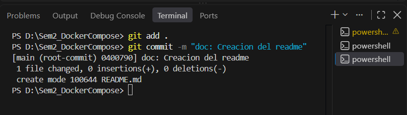
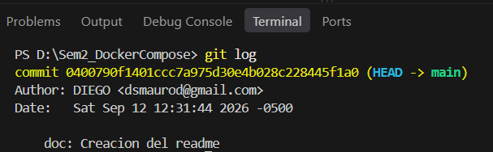
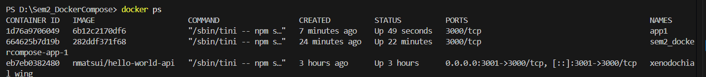
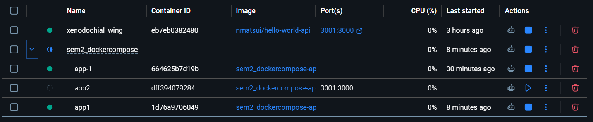

# LABORATORIO 02

Hoy se utilizara docker compose para desplegar el trabajo.
Servicio web y base de datos

# Stack

API
 - Minimal API
    - Debe retornar un mensaje incluyendo mi nombre
    - Docker 
    docker run -d --rm -p 3000:3000 nmatsui/hello-world-api
BD 
- Postgre SQL
$ docker run --name some-postgres -e POSTGRES_PASSWORD=mysecretpassword -d postgres


# Indicaciones

1. Se requiere clonar el repositorio.
2. Se levanta con docker compose up -d --build
3. Abrir local localhost:3001, 3002 y 3003, y conectarse a Postgres en el 5432.


## Comandos 
```bash
docker compose up -d
```
```bash
docker logs
```
```bash
docker ps
```
```bash
docker compose version
```
## Volumenes
Son los que guardan los datos cuando un contenedor es eliminado o se le cambia la imagen. Se implemento en la BD.


### Tipos de volumenes

- Volumen Nombrado: Es aquel en donde se crea y administra almacenamiento, todo referenciado mediante un nombre. Se usa para BD 
- Bind mount: Es montado en una carpeta real dentro del mismo contenedor. Sirve para el desarrollo/edicion de codigo.
- tmpfs: Es el que se mantiene unicamente en la memoria ram. Se usa para los datos temporales.


## Redes


A traves de la red propia, los contenedores se reconocen entre ellos, como si fuera un dominio, a su vez con la BD sin conocer su IP.

### Tipos de Red
- bridge: La red privada enun solo host. Se usa cuando hay o existen varios contenedores en una misma maquina.
- host: El contenedor comparte la misma red del host. Se usa para un maximo rendimiento.
- none: El contenedor se queda sin conectividad. Se suele usar para las tareas aisladas


## Variables y Configuracion por entorno
Son las que permiten cambiar el comportamiento de un contenedor sin modificar ni reconstruir la imagen. Como ejemplos podemos encontrar al env, tanto en el DockerFile, enviroment en docker-compose.yaml y el archivo mismo .env

Variables usadas en este laboratorio:
Algunas de las VE usadas en este proyecto son:
POSTGRES_USER: En la db representa el usuario que crea Postgres al iniciar.
POSTGRES_PASSWORD: Representa la contrasena de ese usuario.
POSTGRES_DB: Es el nombre de la BD inicial

## Creditos
- Mauricio Rodriguez Diego Sebastian

# Evidencias


### Control de versiones

Commit inicial del README en el repositorio.



Historial de commits con git log.



### Contenedores en ejecucion

Salida de docker ps con los contenedores levantados y sus puertos.



Vista inicial de los contenedores del proyecto en Docker Desktop


